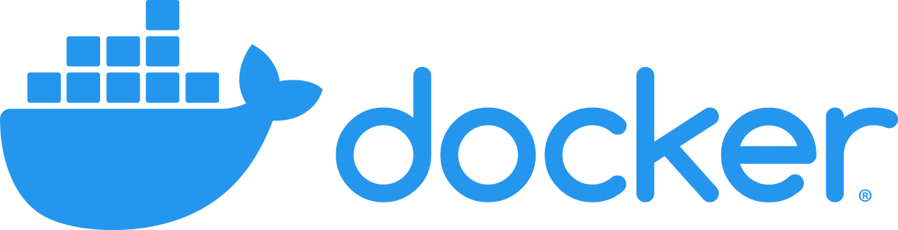

<div id="top"></div>

<div align="center">
 <a href="https://github.com/Link-Wolf/Inception" title="Go to GitHub repo"></a>
 <a href="https://"></a>
 <a href="https://"></a>
 <a href="https://github.com/Link-Wolf/Inception/stargazers"></a>
 <a href="https://github.com/Link-Wolf/Inception/network/members"></a>
 <a href="https://github.com/Link-Wolf/Inception/issues"></a>
 <a href="https://www.apple.com/macos/" title="Go to Apple homepage"></a>
</div>

<!-- PROJECT LOGO -->
<br />
<div align="center">
  <a>
    
  </a>

  <h3 align="center">Inception</h3>

  <p align="center">
   <em>One container is not enoug, we need to go deeper</em><br/>
    A sysadmin project to learn how to use Docker and virtualize a handfull of images
    <br />
    <br />
    <a href="https://github.com/Link-Wolf/Inception/issues">Report Bug</a>
    ·
    <a href="https://github.com/Link-Wolf/Inception/issues">Request Feature</a>
  </p>
</div>

<!-- TABLE OF CONTENTS -->
<details>
  <summary>Table of Contents</summary>
  <ol>
    <li>
      <a href="#about-the-project">About The Project</a>
    </li>
    <li>
      <a href="#getting-started">Getting Started</a>
      <ul>
        <li><a href="#prerequisites">Prerequisites</a></li>
        <li><a href="#installation">Installation</a></li>
      </ul>
    </li>
    <li><a href="#usage">Usage</a></li>
    <li><a href="#roadmap">Roadmap</a></li>
    <li><a href="#contributing">Contributing</a></li>
  </ol>
</details>

<!-- ABOUT THE PROJECT -->

## About The Project

<div align="center">
  <a>
	
  </a>
</div>
</br>
This project aims to set up a mini-infrastructure of differents services by following specific rules. It has to be carried out in a virtual machine and be launced by using ``docker-compose``
Each service will have to run in a dedicated container, and the container names have to match the service name.
They will also have teir own Dockerfile written by ourself and called in the ``docker-compose.yml`` file.
It's forbidden to use already existing images or use services like DockerHub.

We have to set up:

-   A container containing NGINX with TLSv1.2 or TLSv1.3
-   A container containing Wordpress + php-fpm
-   A container containing MariaDB
-   A volume for the database
-   A second volume for the Wordpress files
-   A `docker-network` for the containers to communicate with each other

Each container must restart in case of a crash.
Here's some details about the project:

-   Two users must be created for Wordpress, one of them must be an administrator
-   The domain name has to be configured to point to our local machine
-   This domain name must be secured with a valid SSL certificate and named `[login].42.fr`

<p align="right">(<a href="#top">back to top</a>)</p>

<!-- GETTING STARTED -->

## Getting Started

Since it is a Docker project, there is few preliminary steps.

### Prerequisites

Having [Docker](https://docker.com) installed on your system and be able to run the `docker compose` command on your system
Having `sudo` privileges.

### Installation

1. Clone the repo

    ```sh
    $> git clone https://github.com/Link-Wolf/Inception.git
    ```

2. Launch the project

    ```sh
    $> cd Inception
    $> make
    ```

<p align="right">(<a href="#top">back to top</a>)</p>

<!-- USAGE EXAMPLES -->

## Usage

<div align="center">
 <a>
   
 </a>
</div>

A few rules are implemented in the Makefile to handle the management of the docker:

-   `up`: Creates the directory used for persitence of data (if needed) and creates then starts the containers in detached mode
-   `down`: stops and deletes the containers
-   `stop`: stops the containers
-   `logs`: prints the logs of the containers
-   `clean`: Stops and delete the containers and deletes unused docker stuff
-   `fclean`: Delete absolutely everything deletable via docker
-   `re`: re-does the whole creation of containers from scratch

Once the containers are up and running, you can access the website by going to `https://[login].42.fr` (or localhost:443) and you will be redirected to the Wordpress page.

<p align="right">(<a href="#top">back to top</a>)</p>

<!-- ROADMAP -->

## Roadmap

-   [ ] Add bonus features
-   [x] Add back to top links

See the [open issues](https://github.com/Link-Wolf/Inception/issues) for a full list of proposed features (and known issues).

<p align="right">(<a href="#top">back to top</a>)</p>

<!-- CONTRIBUTING -->

## Contributing

If you have a suggestion that would make this better, please fork the repo and create a pull request. You can also simply open an issue with the tag "enhancement".
Don't forget to give the project a star! Thanks again!

1. Fork the Project
2. Create your Feature Branch (`git checkout -b feature/AmazingFeature`)
3. Commit your Changes (`git commit -m 'Add some AmazingFeature'`)
4. Push to the Branch (`git push origin feature/AmazingFeature`)
5. Open a Pull Request

<p align="right">(<a href="#top">back to top</a>)</p>
